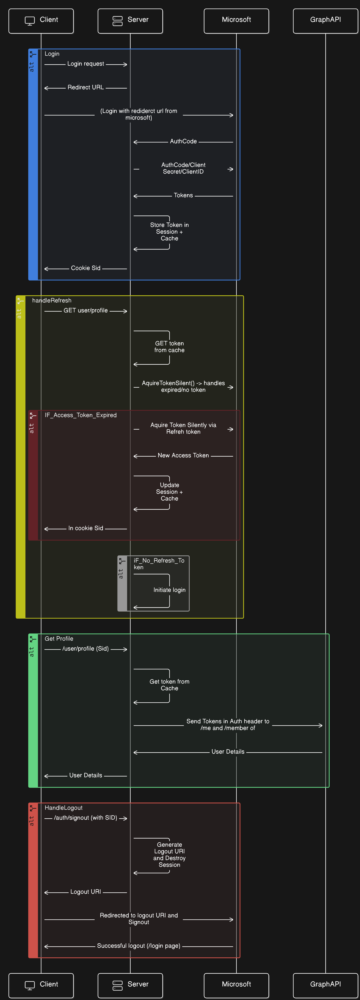

# authService Documentation

## Microsoft Authentication and Authorization using Authorization code flow and MSAL-node

## Flow of the authService



## Folder Structure

- `/client`: Contains the client to show how the auth code flow works.
- `/server`: Contails the server that handles authentication and authorization.
- `docker-compose.yaml`: Docker Compose file for running client, server and redis.

## Prerequisites

Make sure you have Docker and Docker Compose installed on your machine.

## Setup and Usage

1. **Clone this repository**:

```bash
   git clone https://github.com/Avinash9414/authService.git
   cd authService
```

2. **Configure the server**:

   - Please refer to the [README.md](/server/README.md) file in the `/server` folder for instructions on how to configure the server.

3. **Start the services**:

```bash
   docker-compose build
   docker-compose up
```
